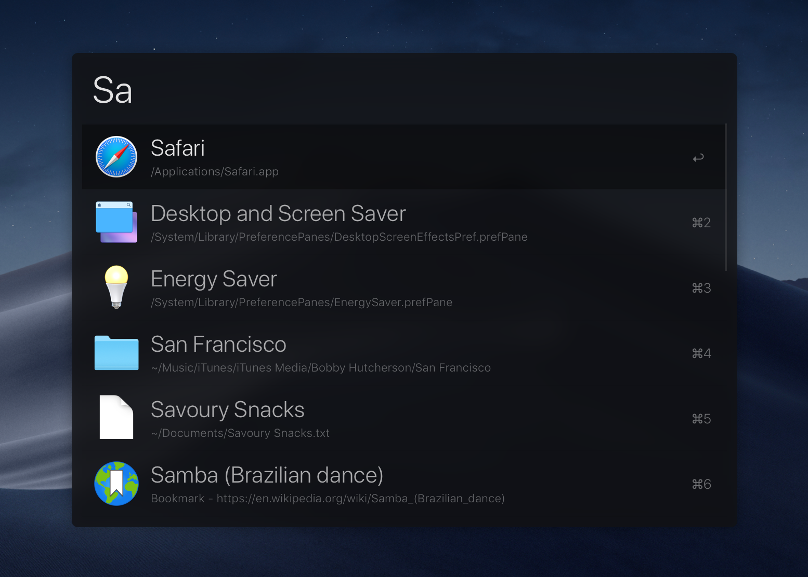
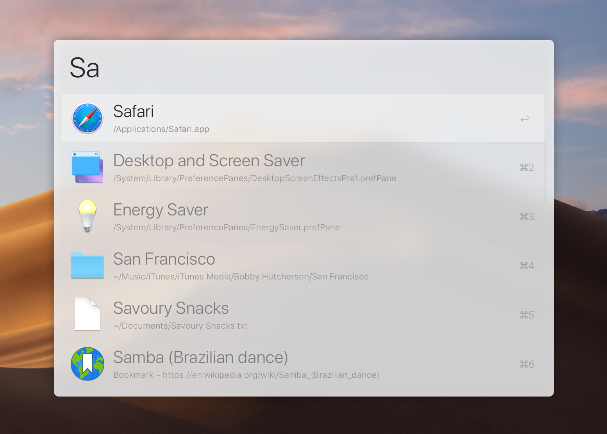

# alfred-simple

> Simple theme for [Alfred](https://www.alfredapp.com)




## Install

- [Dark theme](https://www.alfredapp.com/extras/theme/p0sqEZNzT0/)
- [Light theme](https://www.alfredapp.com/extras/theme/wYHL5VH6EE/)

*You need the [Powerpack](https://www.alfredapp.com/powerpack/) for custom themes.*

Also, you can easily install both or either theme with [homebrew-alfred](https://github.com/danielbayley/homebrew-alfred):

```sh
brew tap danielbayley/alfred
brew cask install alfred-theme-simple-dark
# or
brew cask install alfred-theme-simple-light
# or both
brew cask install alfred-theme-simple
```

## Related

- [alfred-emoj](https://github.com/sindresorhus/alfred-emoj) - Find relevant emoji from text
- [alfred-npms](https://github.com/sindresorhus/alfred-npms) - Search for npm packages with npms.io
